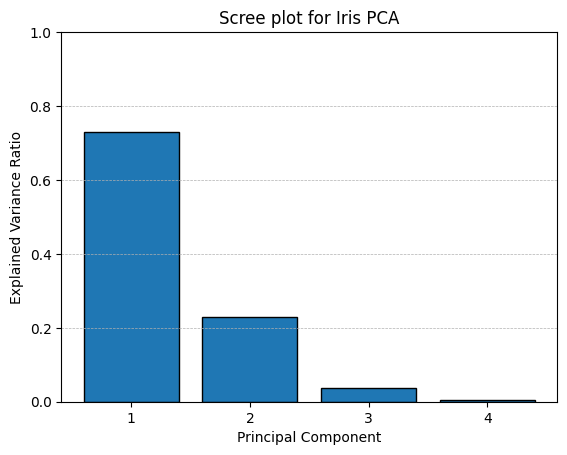
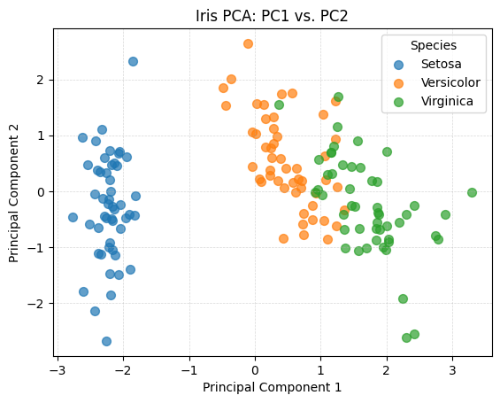

# PCA Tutorial on Iris Dataset

## 🚀 Project Overview

This repository walks through a complete Principal Component Analysis (PCA) workflow on the classic Iris dataset. You'll learn how to:

* Preprocess and standardize data for PCA.
* Compute the covariance matrix and perform eigen decomposition.
* Analyze explained variance and create a scree plot.
* Project high-dimensional data onto the first two principal components.
* Visualize species separation in 2D PC space.

This step-by-step guide is perfect for beginners exploring PCA and GitHub project best practices.

---

## 📁 Repository Structure

```
PCA-tutorial/
├── data/
│   ├── raw/              # Original datasets (iris.csv)
│   └── processed/        # Cleaned & standardized data (iris_clean.csv)
├── notebooks/
│   ├── 01_preprocessing.ipynb  # Data loading & standardization
│   └── 02_pca.ipynb            # PCA analysis & visualizations
├── imgs/                # Generated plots and figures
│   ├── scree.png        # Scree plot of explained variance
│   └── iris_pca_scatter.png  # 2D PCA scatter colored by species
├── .gitignore
├── README.md
└── requirements.txt     # Python dependencies
```

---

## ⚙️ Prerequisites

* **Python 3.8+**
* `pip install -r requirements.txt` (includes `pandas`, `numpy`, `matplotlib`)
* Jupyter Notebook or VS Code with Python extension

---

## ▶️ How to Use

1. **Clone the repo**

   ```bash
   git clone https://github.com/yourusername/pca-tutorial.git
   cd pca-tutorial
   ```

2. **Install dependencies**

   ```bash
   pip install -r requirements.txt
   ```

3. **Run the notebooks**

   * **Preprocessing**: `jupyter notebook notebooks/01_preprocessing.ipynb`
   * **PCA Analysis**: `jupyter notebook notebooks/02_pca.ipynb`

4. **View outputs**

   * Scree plot in `imgs/scree.png`
   * 2D PCA scatter in `imgs/iris_pca_scatter.png`

---

## 📊 Results Preview





*Figure: Iris data projected onto the first two principal components, colored by species.*

---

## 📝 Interpretation

* **PC1 (73% variance)** separates *Setosa* from the other species.
* **PC2 (23% variance)** further distinguishes *Versicolor* and *Virginica*, achieving \~96% total coverage.
* Minimal information is lost by using only two components for visualization.

---

## 🔗 Next Steps

* Experiment with **Kernel PCA** or **t-SNE** for non-linear separations.
* Apply the same workflow to other datasets (e.g., Wine, Digits).
* Integrate into a data pipeline or deploy as a small web app.

---

## 📜 License

This project is released under the MIT License. See [LICENSE](LICENSE) for details.
